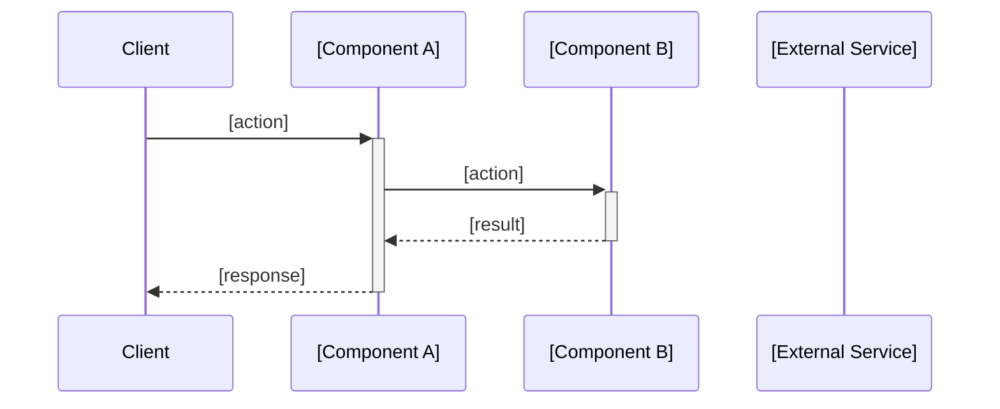

# Data Flow

[One paragraph explaining the scope of this document: which flows are covered and why they
 matter. Example: "This document traces the lifecycle of the two primary user-facing
 operations: task creation (which triggers async email) and authentication."]

## [Primary Flow Name, e.g. "Task Creation Request"]

**Trigger**: [What initiates this flow — HTTP request, message queue event, cron job, etc.]

**Happy path**:

| Step | Component | Action | Output |
|---|---|---|---|
| 1 | [component] | [what it does] | [what it produces] |
| 2 | [component] | [what it does] | [what it produces] |
| N | [component] | [final action] | [final output to user/system] |

**Sequence diagram**:



**Error handling**:

| Error condition | Detected by | Response |
|---|---|---|
| [condition] | [component] | [what happens — retry, fail, alert] |

---

## [Secondary Flow Name]

[Repeat the same structure for each significant flow in the system. Include:
 - Async flows (background jobs, queue consumers)
 - Error/retry flows if they are non-trivial
 - Multi-step pipelines with branching logic
 Skip CRUD operations that are straightforward pass-throughs with no interesting logic.]

**Trigger**: [What initiates this flow]

**Happy path**:

| Step | Component | Action | Output |
|---|---|---|---|
| 1 | [component] | [action] | [output] |

**Sequence diagram**:

```mermaid
sequenceDiagram
    [fill in]
```

**Error handling**:

[Describe what happens when this flow fails — retries, dead-letter queues, user-visible
 errors, fallback behaviours. If the flow has no special error handling, say so explicitly.]

<!-- generated-by: project-docs-skill -->
