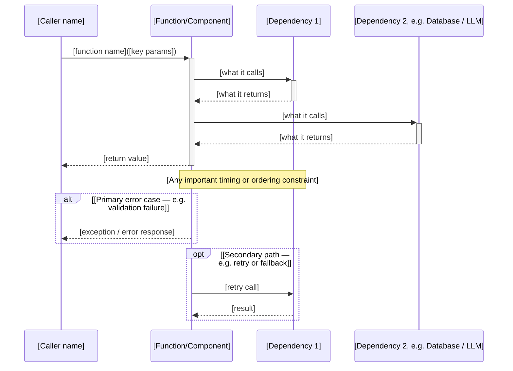

# [Function / Component Name]

> **Module**: `[file path]` · **Line**: [start line] · **Language**: [language]

## Description

[2–4 sentences covering: what this function/component does, what problem it solves, and
 where it fits in the system. This is not a restatement of the function signature — it
 is a plain-English explanation of the intent and role.]

**Signature**:
```[language]
[actual function signature or class definition from source]
```

**Parameters**:
| Parameter | Type | Description |
|---|---|---|
| `[name]` | `[type]` | [what it represents; valid range or constraints] |

**Returns**: [what it returns and under what conditions; null/None/error cases]

---

## Design decisions

[Explain the choices made in the implementation. For each decision, cover:
 - What the code does
 - What alternative approaches exist
 - Why this approach was chosen for this project

This section answers "why is it written this way?" not "what does it do?" — the code
 itself answers the latter.]

1. **[Decision title]** — [the choice, the alternatives, the rationale]
2. **[Decision title]** — [same format]

[Include 2–5 decisions. If the implementation is straightforward with no notable choices,
 write "No non-obvious design decisions — implementation follows standard [pattern] for
 this type of [component]." Do not invent decisions.]

---

## Challenges and complexity

[Describe what makes this function non-trivial. Cover any of the following that apply:]

**Algorithmic complexity**: [Big-O for time and space if relevant; why a simpler approach would not work]

**Concurrency / race conditions**: [Thread safety, lock ordering, deadlock risks if applicable]

**State management**: [What state this function reads or mutates; ordering constraints]

**Edge cases handled**:
- [Edge case] → [how it is handled]
- [Edge case] → [how it is handled]

**Edge cases NOT handled** (known gaps):
- [Case that is not handled and why — "by design" or "not yet implemented"]

[If the function is simple and has no notable complexity, write: "Complexity: O(n) time,
 O(1) space. No concurrency concerns. All edge cases handled inline."]

---

## Sequence diagram

[Mermaid sequenceDiagram showing the complete call chain. Include:
 - Every external caller (HTTP handler, test, CLI)
 - This function/component
 - Every dependency it calls (other services, database, LLM, cache, external API)
 - The return path back to the caller
 - alt/opt blocks for all significant error or branching paths
 Never use ASCII art here — always use a Mermaid code block.]



---

## Consumers

[Who calls this function / depends on this component. Read the codebase to find actual
 callers — do not guess.]

| Caller | Location | How it uses this |
|---|---|---|
| `[function/class name]` | `[file path]:[line]` | [what it does with the result] |

**Called by tests**:
| Test | File | What it verifies |
|---|---|---|
| `[test name]` | `[test file path]` | [what aspect it covers] |

[If this is an entry point with no internal callers (e.g. an HTTP handler, a main function,
 a CLI command), write: "Entry point — invoked by [framework/runtime], not by application code."]

---

## Known issues and potential issues

[Be honest about limitations. This section is for future maintainers, not for marketing.]

**Known bugs / limitations**:
- [Issue and its impact] — [workaround if any]

**Potential issues under load / at scale**:
- [Risk] — [at what threshold it becomes a problem; mitigation if known]

**Security considerations**:
- [Input validation gaps, injection risks, auth bypass vectors, data exposure risks]
- [Write "None identified" if the function has no security surface]

**Technical debt**:
- [Quick-fix or shortcut taken] — [the "right" solution and why it was deferred]

[If there are genuinely no issues, write: "No known issues. No security surface. No
 performance concerns at expected load levels."]

---

## Future enhancements

[Ideas that would improve this function but were not implemented — with reasoning for why
 they were deferred rather than done now.]

| Enhancement | Value | Effort | Blocker or dependency |
|---|---|---|---|
| [What would change] | [Why it would be better] | Low/Med/High | [What needs to happen first] |

[If there are no obvious enhancements, write: "No enhancements identified — current
 implementation fully satisfies requirements."]

---

## Additional context

[Anything else a maintainer needs to understand this function that doesn't fit the sections
 above. Examples:
 - Links to external specifications, RFCs, or papers this implements
 - Historical context: why this was refactored, what replaced what
 - Performance benchmarks or profiling data
 - Relevant external documentation (library docs, API specs)

Omit this section if there is nothing meaningful to add.]

<!-- generated-by: project-docs-skill -->
