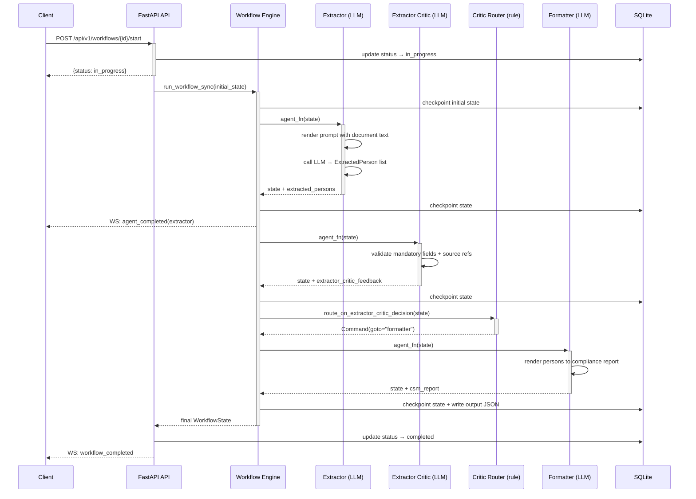
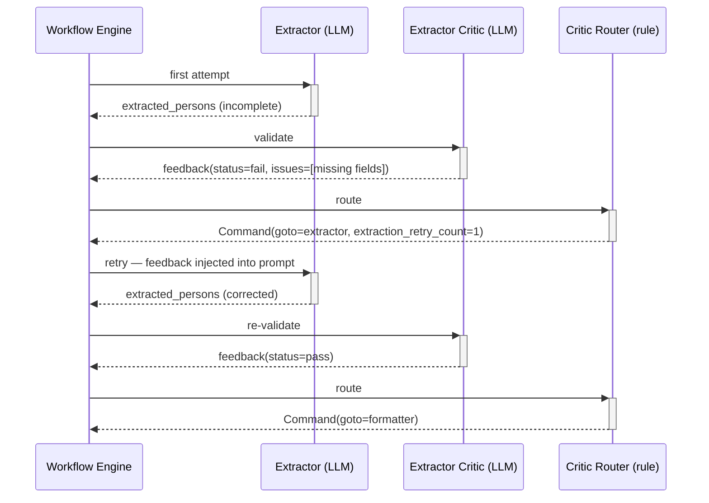

# Data Flow

This document traces the three primary flows in the system: the complete KYC document processing pipeline (upload through compliance report), the critic retry loop (the quality gate between extraction and formatting), and the document upload flow (the synchronous pre-step before processing begins). Understanding all three is essential for debugging stuck or failed workflows.

---

## KYC Document Processing Pipeline

**Trigger**: `POST /api/v1/workflows/{id}/start` — called by the client after documents have been uploaded.

**Happy path**:

| Step | Component | Action | Output |
|---|---|---|---|
| 1 | Workflow Routes | Validates workflow exists and is in `pending` state; updates status to `in_progress` | `WorkflowStartResponse` |
| 2 | Workflow Engine | Creates initial `WorkflowState` from stored documents; invokes compiled LangGraph graph | LangGraph execution begins |
| 3 | Agent Node Wrapper | Emits `workflow_started` audit event and WebSocket event | Client receives real-time update |
| 4 | Document Service | Extracts text from each uploaded PDF/TXT with page boundary tracking | `list[DocumentInput]` in state |
| 5 | Extractor (LLM) | Renders extractor prompt with document text; calls OpenAI/Gemini with structured output schema | `list[ExtractedPerson]` written to state |
| 6 | Agent Node Wrapper | Emits `agent_completed` event for extractor | WebSocket update |
| 7 | Extractor Critic (LLM) | Validates extracted persons against mandatory field rules; produces pass/fail feedback | `ExtractorCriticFeedback` written to state |
| 8 | Extractor Critic Router | Reads feedback; if pass → formatter; if fail and retries remain → extractor; if max retries → END | `Command(goto=...)` |
| 9 | Formatter (LLM) | Renders persons into the compliance report | `csm_report` string written to state |
| 10 | Workflow Engine | Persists final state; updates `WorkflowRunDB.status = completed`; writes output JSON file | — |
| 11 | Audit Service | Writes `workflow_completed` audit log entry with SHA-256 | Immutable audit record |
| 12 | WebSocket | Emits `workflow_completed` event | Client receives final notification |

**Sequence diagram**:

**Error handling**:

| Error condition | Detected by | Response |
|---|---|---|
| PDF cannot be parsed by pdfplumber | Document Service | Retry with PyMuPDF; if both fail, mark document `processing_status: failed` and continue with remaining documents |
| LLM returns malformed structured output | Agent Factory | `tenacity` retry up to `LLM_RETRY_ATTEMPTS` with exponential backoff; raises after exhaustion |
| Critic fails extraction quality check | Extractor Critic Router | Increment `extraction_retry_count`; route back to extractor with feedback in state; halt at `MAX_RETRY_ATTEMPTS` |
| Workflow reaches max LangGraph steps | LangGraph | Raises `GraphRecursionError`; caught by workflow engine; status → `failed` |
| Unhandled exception in any agent | Agent Node Wrapper | Writes `agent_failed` audit log; propagates to workflow engine; status → `failed` |

---

## Critic Retry Loop

**Trigger**: The Extractor Critic returns a `fail` status in `extractor_critic_feedback`.

The retry loop is the most complex flow in the system because state mutation (incrementing the retry counter) and routing (deciding which node to visit next) must happen atomically. This is why the router is a LangGraph node returning `Command`, not a conditional edge function.

**Happy path** (retry then pass):

| Step | Component | Action | Output |
|---|---|---|---|
| 1 | Extractor Critic | Validates persons; finds missing mandatory fields | `ExtractorCriticFeedback(status="fail", issues=[...])` |
| 2 | Critic Router | Reads feedback; `retry_count < 4` → increments counter atomically | `Command(goto="extractor", update={"extraction_retry_count": n+1})` |
| 3 | Extractor (retry) | Re-reads documents with critic feedback injected into prompt via `{{extractor_critic_feedback}}` placeholder | Updated `extracted_persons` in state |
| 4 | Extractor Critic | Re-validates improved extraction | `ExtractorCriticFeedback(status="pass")` |
| 5 | Critic Router | Reads pass status | `Command(goto="formatter")` |

**Sequence diagram**:

**Error handling**:

| Error condition | Detected by | Response |
|---|---|---|
| `extraction_retry_count >= 4` | Critic Router | `Command(goto=END, update={status: failed, failure_reason: "max retries"})` — workflow halts |
| Critic feedback is `None` | `route_on_extractor_critic_decision` | Logged as warning; treated as pass (safe default to avoid silent loops) |
| Unexpected critic decision value | `route_on_critic_decision` | Logged as warning; routed to `fail_max` (conservative default) |

---

## Document Upload Flow

**Trigger**: `POST /api/v1/workflows` with multipart form data containing one or more files.

This flow runs synchronously before the pipeline starts. It is intentionally separate so the client can upload documents, verify them, and then trigger processing when ready.

| Step | Component | Action | Output |
|---|---|---|---|
| 1 | Workflow Routes | Validates each file type (PDF, TXT only) and size (`MAX_FILE_SIZE_MB`) | Rejects invalid files with `422` |
| 2 | Storage Service | Creates `WorkflowRunDB` record with status `pending` | `workflow_id` |
| 3 | Document Service | Extracts page count from each PDF (pdfplumber peek) without full text extraction | `page_count` per document |
| 4 | Storage Service | Creates `UploadedDocumentDB` record per file; writes file to `UPLOAD_DIR/{workflow_id}/` | `document_id` per file |
| 5 | Audit Service | Writes `document_uploaded` audit log for each file | Immutable record |
| 6 | Workflow Routes | Returns `WorkflowCreateResponse` with `workflow_id` and document list | Client stores `workflow_id` for subsequent calls |

<!-- generated-by: project-docs-skill -->
