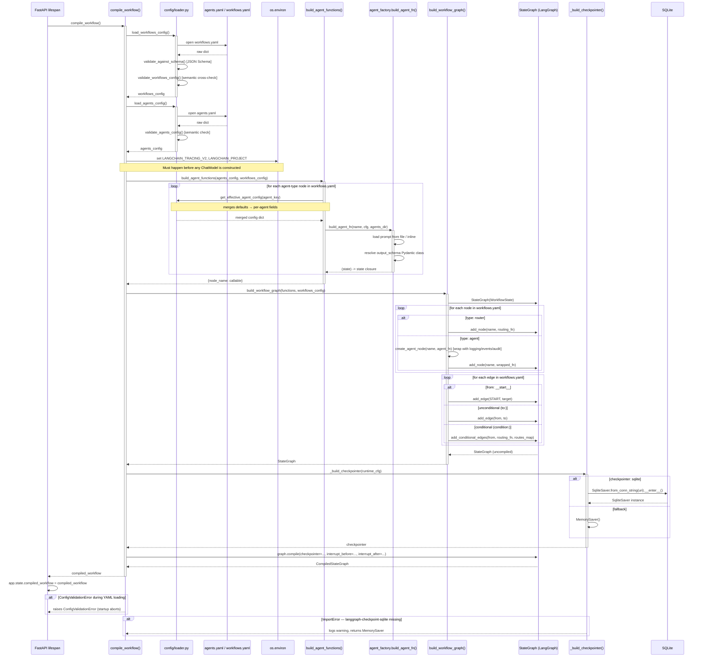

# Implementation Deep-Dives

Detailed internal analysis of key functions and components. Each section covers design decisions, complexity, sequence diagrams, consumers, known issues, and future directions.

---

## `compile_workflow`

> **Module**: `src/core/workflow.py` · **Line**: 322 · **Language**: Python 3.11+

## Description

`compile_workflow` is the application bootstrap function that transforms the two YAML configuration files (`agents.yaml` + `workflows.yaml`) into a compiled, executable LangGraph `StateGraph`. It is called exactly once — during FastAPI startup — and the result is stored in `app.state.compiled_workflow` for reuse across all requests. It coordinates five sequential concerns: loading config, wiring observability, building agent callables, assembling the graph topology, and attaching the checkpointer.

The function is the boundary between declarative configuration (YAML) and executable Python (LangGraph). Nothing in the graph structure is hardcoded — every node, edge, model name, and retry policy comes from files on disk.

**Signature**:
```python
def compile_workflow(
    workflows_config: dict[str, Any] | None = None,
    agents_config: dict[str, Any] | None = None,
) -> Any:
```

**Parameters**:
| Parameter | Type | Description |
|---|---|---|
| `workflows_config` | `dict \| None` | Pre-loaded workflows config dict. If `None`, loads from `src/config/workflows.yaml`. Pass explicitly in tests to avoid disk I/O. |
| `agents_config` | `dict \| None` | Pre-loaded agents config dict. If `None`, loads from `src/config/agents.yaml`. Pass explicitly in tests. |

**Returns**: A compiled LangGraph graph object (type `CompiledStateGraph`). Raises `ConfigError` or `ConfigValidationError` if either YAML file is malformed or fails semantic cross-validation.

---

## Design decisions

1. **Accept pre-loaded config dicts instead of file paths** — Both parameters default to `None` and trigger file loading only when absent. This lets integration tests pass in-memory dicts and bypass file I/O entirely, while production code calls `compile_workflow()` with no arguments. The alternative — always loading from disk — would require test fixtures to write real YAML files, making tests brittle and slow.

2. **Observability wired before graph construction** — LangSmith tracing environment variables (`LANGCHAIN_TRACING_V2`, `LANGCHAIN_PROJECT`) are set before `build_agent_functions()` is called. LangChain reads these at import time or at first call; setting them after agent construction could result in the first few LLM calls going untraced. The trade-off is that setting env vars as a side effect inside a function is non-obvious and makes the function impure.

3. **`SqliteSaver` context manager entered without a matching `__exit__`** — `_build_checkpointer()` calls `cm.__enter__()` to get the saver instance but never calls `__exit__`. The connection stays open for the lifetime of the process, which is intentional (the checkpointer must persist between requests), but it means the SQLite connection is leaked if the process crashes without a clean shutdown. The alternative (re-opening the connection per workflow run) would lose the ability to resume interrupted workflows via thread_id.

4. **`build_workflow_graph` is a separate function, not inlined** — The graph assembly logic lives in `build_workflow_graph()` so integration tests can call it directly with a pre-built `functions` dict, bypassing `compile_workflow`'s config loading and observability wiring. This separation also makes it easier to unit-test the node/edge wiring logic in isolation from the YAML parsing.

5. **Router nodes registered directly, without the `create_agent_node` wrapper** — In `build_workflow_graph`, `type: router` nodes are added with `graph.add_node(name, routing_fn)` — no logging wrapper, no audit trail. This is intentional: router nodes return `Command` objects and do not produce agent output; wrapping them would add misleading `agent_started`/`agent_completed` audit events for what is a pure routing decision. The cost is that router failures are not captured in the audit trail.

---

## Challenges and complexity

**Ordering constraint — observability before agents**: LangSmith tracing must be activated before any `ChatOpenAI` or `ChatGoogleGenerativeAI` instance is constructed inside `build_agent_functions`. LangChain reads the tracing flag at construction time in some versions. The current implementation happens to get this right because observability wiring precedes `build_agent_functions`, but there is no explicit test enforcing this ordering. A refactor that reorders these calls could silently break tracing.

**SqliteSaver context manager lifecycle**: `SqliteSaver.from_conn_string()` returns a context manager. The code calls `.__enter__()` to get the saver but has no corresponding `.__exit__()` call. The SQLite WAL connection is held open for the process lifetime. If `langgraph-checkpoint-sqlite` changes its internal resource management in a future version, this pattern could break or cause resource exhaustion.

**Edge cases handled**:
- `checkpointer = sqlite` but `langgraph-checkpoint-sqlite` not installed → catches `ImportError`, logs a warning, falls back to `MemorySaver` silently
- `SqliteSaver` construction fails (e.g. disk full, bad URI) → catches `Exception`, logs warning, falls back to `MemorySaver`
- `observability.provider` is anything other than `"langsmith"` → no-op; no tracing configured; no error raised
- `interrupt_before` / `interrupt_after` are empty lists → correctly omitted from `compile_kwargs` to avoid passing empty lists to LangGraph's `compile()`

**Edge cases NOT handled**:
- `workflows_config` and `agents_config` provided together but inconsistent (e.g. different agent keys) — cross-validation only runs when loading from disk; pre-loaded dicts are used as-is
- Hot reload of YAML without process restart — the compiled graph is frozen at startup; changing `agents.yaml` requires a server restart to take effect
- Multiple simultaneous calls to `compile_workflow()` — not thread-safe; if two threads call it concurrently at startup, two `SqliteSaver` connections could be opened against the same database

---

## Sequence diagram



---

## Consumers

| Caller | Location | How it uses this |
|---|---|---|
| `lifespan` (FastAPI startup) | `src/api/main.py:40` | Calls `compile_workflow()` with no args; stores result in `app.state.compiled_workflow`; shared across all request handlers |
| `test_extraction_pass` | `tests/integration/test_extraction_end_to_end.py:85` | Calls `compile_workflow()` with no args inside a patched context (LLM calls mocked); verifies the full graph compiles and executes without error |
| `test_extraction_critic_fail_then_pass` | `tests/integration/test_extraction_end_to_end.py:122` | Same pattern; tests the critic retry loop by sequencing mock responses across two extractor calls |

**Called by tests**:
| Test | File | What it verifies |
|---|---|---|
| `test_extraction_pass` | `tests/integration/test_extraction_end_to_end.py` | Graph compiles; extractor → critic (pass) → formatter runs to completion |
| `test_extraction_critic_fail_then_pass` | `tests/integration/test_extraction_end_to_end.py` | Retry loop: extractor → critic (fail) → extractor (retry) → critic (pass) → formatter |

---

## Known issues and potential issues

**Known bugs / limitations**:
- `SqliteSaver.__exit__` is never called — the SQLite connection is held open indefinitely. If the process is killed with SIGKILL (not SIGTERM), the WAL file may not be properly finalised. Impact: low in practice (SQLite recovers WAL on next open), but theoretically lossy.
- No hot reload — YAML changes require a process restart. There is no file watcher or reload endpoint. For a development workflow this is inconvenient; there is no workaround short of restarting uvicorn.

**Potential issues under load / at scale**:
- `compile_workflow()` is not thread-safe. If the FastAPI lifespan is somehow called concurrently (e.g. in a test that creates multiple `TestClient` instances), two `SqliteSaver` connections against the same SQLite file could interfere. SQLite's WAL mode handles concurrent readers safely but only one writer at a time.
- Loading and validating YAML on every test run that calls `compile_workflow()` with no args is slow (~100–200ms). At current test count (2 integration tests) this is acceptable; at 20+ tests it becomes noticeable. Mitigation: use the pre-loaded config parameters to pass in-memory dicts.

**Security considerations**:
- `resolve_callable` (called inside `build_agent_functions` and `build_workflow_graph`) dynamically imports arbitrary Python modules named in YAML. A malicious `agents.yaml` or `workflows.yaml` with a crafted `rule_fn` or `fn` value could execute arbitrary code at startup. This is only a risk if the YAML files are writable by an untrusted party — in the current deployment model (files in the repo, not user-supplied) it is acceptable.

**Technical debt**:
- The `SqliteSaver` context manager entry without exit (`cm.__enter__()` with no `__exit__`) is a known shortcut — the "right" solution is to manage it as an application-level resource via FastAPI's `lifespan` async context manager, calling `__aenter__`/`__aexit__` on startup/shutdown. This was deferred because it requires making `_build_checkpointer` async-aware.

---

## Future enhancements

| Enhancement | Value | Effort | Blocker or dependency |
|---|---|---|---|
| Hot reload of YAML without restart | High — speeds up iteration when tuning prompts or retry counts | Medium | Need a file watcher (e.g. `watchfiles`) and a way to atomically swap `app.state.compiled_workflow` |
| Proper `SqliteSaver` lifecycle in FastAPI `lifespan` | Low-Medium — eliminates the leaked context manager | Low | Need to make `_build_checkpointer` async and use `async with` in the lifespan handler |
| Schema caching — skip JSON schema reload on each test call | Low — reduces test startup time | Low | Cache the loaded schema dict as a module-level singleton |
| Support `postgres` checkpointer from `runtime.checkpointer` | High — enables horizontal scaling and production-grade persistence | High | Requires `langgraph-checkpoint-postgres`; connection pooling; async checkpointer |
| Validate `interrupt_before`/`interrupt_after` node names exist in the graph | Medium — catches YAML typos that currently silently produce broken interruption behaviour | Low | Add a check in `validate_workflows_config` before `compile_workflow` is called |

<!-- generated-by: project-docs-skill -->
